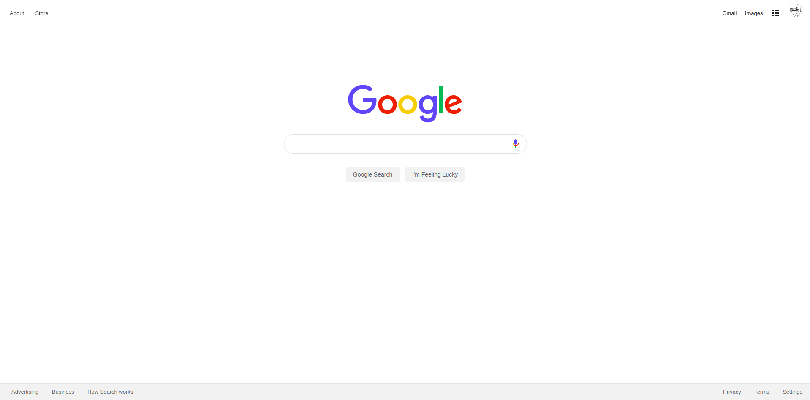

## Build the Google Homepage

### Goal
- Reconstruct the Google homepage using HTML/CSS - [The Odin Project](https://www.theodinproject.com/courses/web-development-101/lessons/html-css)

### Demo
- [View on the web](https://myoiwritescode.github.io/projects/google-homepage/)

### Reflection
- Part of working process on YouTube - [Part 1](https://youtu.be/Hq7sR-suNhY), [Part 2](https://youtu.be/XjsHG46kHDo)

Top-right navigation part was hard for me to align them vertically. I used two `float` to arrange them and tweaked padding and margins to make it work, but I realized I could have used the `grid` and `flex-box` to align them. 

When I minimize the original Google's homepage, none of the sizes (like the width of the navigation bar or where the logo and search bar is located) do not change that I need to scroll to the right to see all them. But in my Google replication, Every elements except the search-bar move its position automatically (I think this has to do with `margin: 0 auto`) so the logo and the search bar is not positioned correctly on narrow page.

I still need to work on CSS especially the `grid` and different types of display such as `flex` model.
