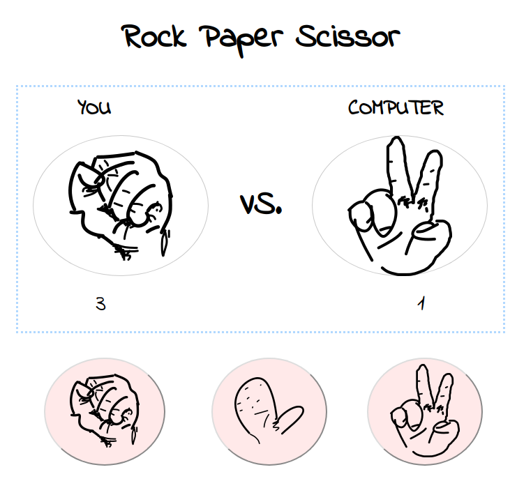

## Rock Paper Scissor Game

### Goal
- Create a 'Rock Paper Scissor' game using HTML/CSS and JavaScript.

### Demo
- [View on the web](https://muicode.github.io/projects/rock-paper-scissor/)

<a href="#" style="float: left;"></a>

### Reflection

#### Design
Aligning items and elements were the most struggling part I went through from this Rock Papr Scissor, or RPS, project.

I have been using floats everywhere, but it wasn't so pretty.

So I decided to go with `flexbox`. It was my first attempt using it but the concept was fairly easy to understand.
I'm sure `flex` can be much more complex and complicated, but first couple pages of the [tutorial](https://internetingishard.com/html-and-css/flexbox/) was just enough to align items as how I wanted.

#### DOM
I started to understand how DOM tree is formed. This is due to my experince of mixing up using `firstChild` and `firstElementChild`. It seems like not only elements, but texts are also formed
in a DOM tree as a node including the newline.

I had lot of confusions on toggling and editing current attributes.

```js
// this is mistake
[some-img-tag].style.src = "" 

// should be this
[some-img-tag].src = "" 
```

I've been adding `style` whenever I edit something but I realized `src` or `href` are not styles. 

And for the toggling, I thought I had to add them, that I tried...

```js
// failed => missing an argument
[some-button].setAttribute('disabled');

// correct
[some-button].toggleAttribute('disabled');
```

I should be more careful about which one is a style and not, and which selectors I should use for the action I want.
